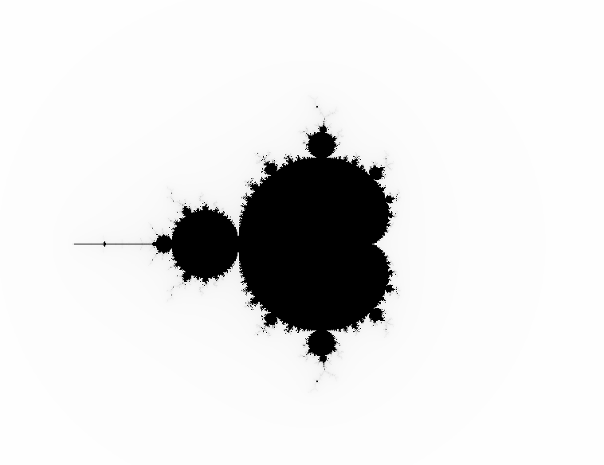

# Mandelbrot Fractal Generator using SDL2



This is a C++ program that generates the famous Mandelbrot fractal and renders it using SDL2. The Mandelbrot fractal is a captivating mathematical structure known for its intricate and infinitely detailed patterns. This project allows you to explore and visualize the Mandelbrot set.

## Table of Contents

- [Mandelbrot Fractal Generator using SDL2](#mandelbrot-fractal-generator-using-sdl2)
  - [Table of Contents](#table-of-contents)
  - [Introduction](#introduction)
  - [SDL2](#sdl2)
  - [How it Works](#how-it-works)
  - [Usage](#usage)
  - [Customization](#customization)
    - [1. Rendering Size and Quality](#1-rendering-size-and-quality)
    - [2. Color Palette](#2-color-palette)
    - [3. Code Documentation](#3-code-documentation)
    - [4. Experimentation](#4-experimentation)
  - [SDL2-Installation](#sdl2-installation)
    - [Windows](#windows)
    - [macOS](#macos)
    - [Linux (Ubuntu/Debian)](#linux-ubuntudebian)
    - [Other Linux Distributions](#other-linux-distributions)

## Introduction

The Mandelbrot set is a set of complex numbers defined by iterating a simple mathematical formula: `Z = Z^2 + c`, where `Z` and `c` are complex numbers. The fractal is generated by determining whether a given complex number `c` belongs to the Mandelbrot set or not. The color of each pixel in the rendered image depends on how many iterations it takes for a complex number to escape the bounds of the Mandelbrot set.

## SDL2

SDL2 (Simple DirectMedia Layer 2) is a cross-platform development library designed to provide low-level access to audio, keyboard, mouse, joystick, and graphics hardware via OpenGL and Direct3D. In this project, SDL2 is used for creating a window, rendering graphics, and handling user input.

## How it Works

The code defines a function `isInMandelbrotSet` that checks whether a given complex number `c` is within the Mandelbrot set. It does this by repeatedly iterating the formula `Z = Z^2 + c` for a maximum number of iterations (50 in this case) or until the squared magnitude of `Z` exceeds a threshold value (16 in this case).

The main program initializes SDL2, creates a window and renderer, and then loops through a grid of complex numbers in the range of `(-3, -3)` to `(3, 3)`. For each point in the grid, it calls `isInMandelbrotSet` to determine if it belongs to the Mandelbrot set and sets the color of the corresponding pixel accordingly.

Certainly, here's an expanded section on customization for your README:

## Usage

To run this program, you need to have SDL2 installed on your system.
[Guide to install SDL2](#sdl2-installation). 

Download the Project file from [here](mandelbrotFractal.cpp)

You can compile the code using a C++ compiler with the SDL2 library linked. Here's a basic compilation command using g++:

```bash
g++ -o mandelbrotFractal mandelbrotFractal.cpp -lSDL2
```

After compilation, you can execute the program:

```bash
./mandelbrotFractal
```

## Customization

The code for this Mandelbrot Fractal Generator is designed to be highly customizable and easily adaptable to your specific needs. Here are some ways you can tailor the code to suit your preferences:

### 1. Rendering Size and Quality

You have control over the size and quality of the rendered fractal by adjusting the loop parameters in the code. In the main loop of the program, you can modify the following parameters:

- `for (double x = 0.0; x < 1.0; x += 0.001)`: This loop controls the x-coordinate of the points you check for the fractal. You can change the start (`0.0`), end (`1.0`), and step size (`0.001`) to focus on specific regions or increase/decrease the resolution.

- `for (double y = 0.0; y < 1.0; y += 0.001)`: Similar to the x-loop, this loop controls the y-coordinate of the points you check. You can customize the range and step size as needed.

- `int iterations = isInMandelbrotSet(std::complex<double>(pointX, pointY));`: The number of iterations in the `isInMandelbrotSet` function determines the quality of the render. You can increase or decrease the number of iterations to refine or speed up the rendering process. Be cautious not to set it too high, as it may lead to longer processing times.

### 2. Color Palette

You can customize the color palette used to render the Mandelbrot set. In the code, colors are determined by the number of iterations it takes for a point to exit the Mandelbrot set. You can modify the colors by adjusting the values passed to `SDL_SetRenderDrawColor` based on the `iterations` variable. Experiment with different color schemes to achieve the desired visual effect.

### 3. Code Documentation

The code is well-documented with comments to help you understand its functionality and make modifications. Each major section of the code is explained, making it easier to customize or extend the program to add additional features or optimizations.

### 4. Experimentation

Feel free to experiment and explore the Mandelbrot set by modifying the code further. You can implement zooming capabilities, save high-resolution images, or create animations by integrating additional SDL2 features.

The possibilities for customization are virtually limitless, allowing you to unleash your creativity and explore the beauty of the Mandelbrot set in your own unique way. Enjoy coding and discovering the fascinating world of fractals!

## SDL2-Installation

To install SDL2, you'll need to follow platform-specific instructions, as the installation process can vary depending on your operating system. Here are instructions for common platforms:

### Windows

1. **Download SDL2 Development Libraries:**
   - Go to the SDL2 download page: [https://www.libsdl.org/download-2.0.php](https://www.libsdl.org/download-2.0.php).
   - Under "Development Libraries," download the "Visual C++" version (e.g., `SDL2-devel-2.x.x-VC.zip`).
   - Extract the contents of the downloaded ZIP file to a location on your computer.

2. **Set Up Visual Studio (If Using Visual Studio):**
   - If you're using Visual Studio, create a new C++ project.
   - Go to "Project Properties" > "Configuration Properties" > "VC++ Directories."
   - Add the path to the `include` directory inside the extracted SDL2 folder to "Include Directories."
   - Add the path to the `lib` directory inside the extracted SDL2 folder to "Library Directories."

3. **Link SDL2 Library:**
   - Under "Configuration Properties" > "VC++ Directories," add `SDL2.lib` and `SDL2main.lib` to "Additional Dependencies" under "Linker" > "Input."

4. **Copy SDL2.dll:**
   - From the extracted SDL2 folder, copy `SDL2.dll` to your project's executable directory (where your `.exe` file is located).

### macOS

1. **Using Homebrew (Recommended):**
   - Open Terminal.
   - Install Homebrew if you haven't already: [https://brew.sh/](https://brew.sh/)
   - Run the following command to install SDL2:

     ```bash
     brew install sdl2
     ```

2. **Using MacPorts (Alternative):**
   - Open Terminal.
   - Install MacPorts if you haven't already: [https://www.macports.org/install.php](https://www.macports.org/install.php)
   - Run the following command to install SDL2:

     ```bash
     sudo port install libsdl2
     ```

### Linux (Ubuntu/Debian)

1. **Using APT:**
   - Open Terminal.
   - Update your package list:

     ```bash
     sudo apt-get update
     ```

   - Install SDL2 development libraries:

     ```bash
     sudo apt-get install libsdl2-dev
     ```

2. **Using Snap (Alternative):**
   - Open Terminal.
   - Install SDL2 via Snap:

     ```bash
     sudo snap install sdl2
     ```

### Other Linux Distributions

You can typically install SDL2 via your distribution's package manager. Use the appropriate package manager and search for the SDL2 development libraries.

After installing SDL2, you can compile and run your SDL2-based C++ programs by including the appropriate SDL2 headers and linking against the SDL2 library during compilation.

Remember to consult the SDL2 documentation and your specific development environment for any additional setup or configuration that may be required.
